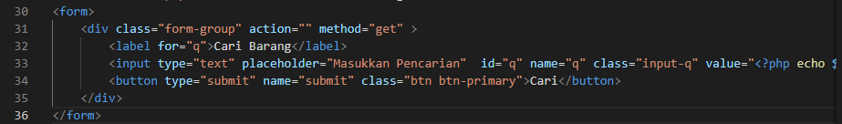
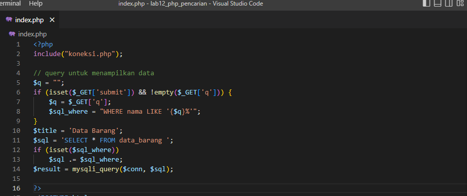
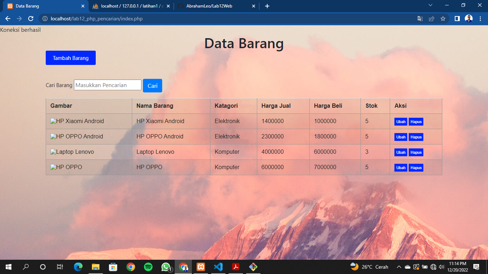
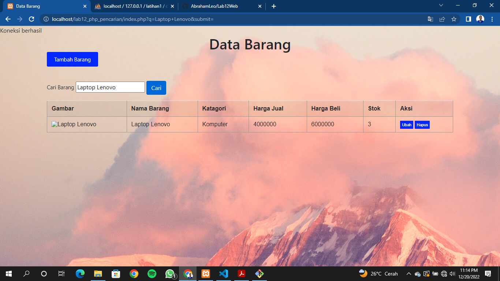

# Lab12Web
## Membuat Pencarian Data
Untuk membuat pencarian data, yang perlu di perhatikan adalah penggunaan filter pada query data.
Pada data awal, query untuk menampilkan semua data adalah:
$sql = “SELECT * FROM data_barang”;
Nah untuk menambahkan pencarian, maka query tersebut harus ditambahkan klausa WHERE sebagai filter, sehingga menjadi:
$sql = “SELECT * FROM data_barang WHERE nama = ‘{$var_nama}’”;
Atau dapat juga menggunakan LIKE seperti berikut:
$sql = “SELECT * FROM data_barang WHERE nama LIKE ‘{$var_nama}%’”;
Langkah selanjutnya adalah membuat form pencarian.

Sisipkan kode tersebut pada file index.php (daftar barang), sebelum table data dan sesudah tombol tambah data.  
Lalu rubah querynya dan tambahkan filter pencarian pada query tersebut.

Maka Hasilnya akan seperti ini

Jika melakukan pencarian hasilnya seperti ini
